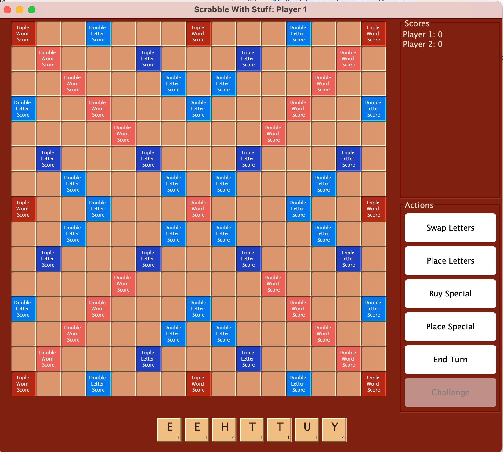
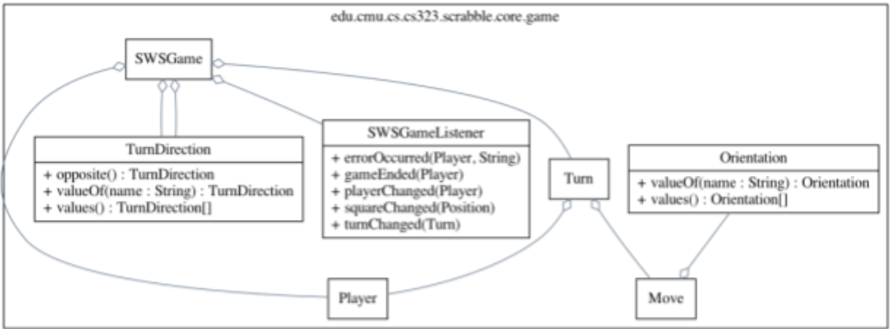

17-623: Quality Assurance: Scrabble with Stuff
===================
## Project Description 
The purpose of this project is to provide a model problem for you to apply the quality assurance techniques and methods presented in the course. You are tasked with evaluating the quality of an existing software project. Remember that the goals of this course are software quality analysis, not software development. During our class this project will serve as the basis for assignments on software testing, analysis, and quality assessment. Each assignment will ask you to use the project artifacts to perform a type of quality assessment. 

Each assignment has different technical and analytical requirements. Most assignments  require  a small amount of coding, however those coding tasks are relatively straightforward and meant to provide a basis for assessing software quality. The course is focused on software quality analysis rather than software development. 

There are currently five assignments planned:

1. Set up infrastructure and create conceptual models for quality evaluation
2. Perform software testing focused on functional correctness
3. Perform fuzz testing to evaluate reliability and security
4. Develop testing infrastructure to support higher level testing
5. Apply static analysis tools to a realistic codebase

Additionally, you will be asked to summarize your assessments in the form of a final report on the overall quality of this project. The details of this project are included at the end of this document. You should read the requirements  for the final prior to each individual assignment because you will be required to assess quality data collected during each assignment.

## Learning Goals
We will use the Scrabble with Stuff game as a context for our assignments. Note that our goals are not to become an expert in game design or Java development. Rather, Scrabble with Stuff serves as a testbed for you to apply the techniques and tools taught throughout the course on a real codebase. Development may be necessary to fully explore quality assurance and control techniques, but programming is not the main focus. The major learning goal of this project is to use different software quality assurance techniques on realistically complex software.

## Project Overview

Assume that you are working for Tartan Inc., a successful video game company. Tartan Inc. has recently acquired a startup, AdHoc Games, that was working on a new computer Scrabble game. Management wants to improve and release AdHoc Game’s new Scrabble game, but there are concerns that the existing system is low quality and too rudimentary in comparison to its competitors. Before the game is released to the public, it must be enhanced to be more compelling and thoroughly evaluated to ensure that it meets stated requirements and Tartan Inc. quality standards. Your goal is to conduct this evaluation. The video game industry is highly competitive and time is short, so you must be purposeful and prudent with the decisions that you make. You must ultimately make a recommendation to your supervisor as to whether the game is ready to release.

## Scrabble With Stuff Initial System Design & Requirements
The existing game is implemented as a simple Java application that supports up to five players via a basic graphical user interface, shown in Figure 1.

Figure 1: Scrabble with Stuff display

Like traditional Scrabble, players take turns placing letters (to form words) on a two-dimensional grid board, earning points for the words they place on the board. However, each player has a private view of her board and cannot view other players’ tiles. The game’s current implementation roughly follows the official Hasbro rules,(https://scrabble.hasbro.com/en-us/rules) including features such as double letter score, triple letter score, double word score, and triple word score squares on the game board; your game does not need to include blank letter tiles; it should include challenges of words by other players using the double challenge rules described in the official rules (see also Scrabble challenge on Wikipedia).

In Scrabble with Stuff, in addition to letter tiles of the classic game, a player may purchase special tiles with the points she has earned so far. These special tiles are added to the player’s inventory of tiles, and may be played in a subsequent turn along with a word. Pre-existing Scrabble board squares (such as double letter score, etc.) may not be purchased like special tiles.
After placing a special tile, the tile is visible to the player who played it but is invisible to all other players in the game. A special tile is activated when a regular tile is placed on top of it. When activated, a special tile has an immediate or latent effect on the game, depending on its type.

There are several types of special tile in this game:

* **Negative-points**: The word that activated this tile is scored negatively for the player who activated the tile; i.e., the player loses (rather than gains) the points for the played word.
* **Reverse-player-order**: The turn ends as usual, but after this tile is activated play
continues in the reverse of the previous order.
* **Boom**: All tiles in a 3-tile radius on the board are removed from the board. Only
surviving tiles are scored for this round.
* **Steal**: Special tile that causes the player who placed the tile to earn the points the player
who activated it would have gained.
* **Skip**: A special tile causes the player who triggered the tile to lose their next turn.

Fundamentally the Scrabble with Stuff game has the following goals:
* Correctly implement and enforce the rules of Scrabble. Specifically ensure that only valid words are allowed (according to a dictionary), enforce player turns, ensure scoring is accurately performed.
* Each player can make one move per turn and may only end their turn once per cycle.
* Allow users to add new types of tiles in the future.
* Facilitate multi user game play (with at least two players and no more than 4 players). This includes ensuring that each player’s data remains private and that the game progresses to completion. A player should be able to terminate the game at any time.
* Enable the use of different word dictionaries from different storage locations, such as files, databases, network services. Once a dictionary has been selected it should be the only dictionary used during an active game.
* Each player should have one move per turn.
* The game must have only one winner. The game cannot end in a tie.
* Given that this game is actively being developed, it should be designed with testability in
mind.

The game is broadly broken into two packages: gui and core. The gui package is responsible for the user interface elements of the program and core contains the game logic. Table 1 lists each package.

---
| Package name                                        | Purpose/Description                                                                                |
|-----------------------------------------------------|----------------------------------------------------------------------------------------------------|
| edu.cmu.cs.cs323.scrabble.core.board                | Contains logic related to scrabble board management.                                               |
| edu.cmu.cs.cs323.scrabble.core.board.square         | Contains logic related to scrabble board square scoring and management.                            |
| edu.cmu.cs.cs323.scrabble.core.game                 | Contains primary game management logic.                                                            |
| edu.cmu.cs.cs323.scrabble.core.letters              | Manages letter and point values.                                                                   |
| edu.cmu.cs.cs323.scrabble.core.specialtile          | Manages "special tiles" in the game. Special tiles perform some sort of action on the current game usually to the advantage of  the person placing it. |
| edu.cmu.cs.cs323.scrabble.core.specialtile.defaults | Specific special tiles.                                                                             |
| edu.cmu.cs.cs323.scrabble.core.specialtile.store    | Logic related to buying special tiles.                                                             | 
| edu.cmu.cs.cs323.scrabble.core.validation           | Manages which words are and are not valid for a game.                                              | 
| edu.cmu.cs.cs323.scrabble.gui                       | The driver for the user interface                                                                  | 
| edu.cmu.cs.cs323.scrabble.gui.board                 | GUI for the game board.                                                                            | 
| edu.cmu.cs.cs323.scrabble.gui.board.square          | GUI for squares.                                                                                   | 
| edu.cmu.cs.cs323.scrabble.gui.letters               | GUI for letters.                                                                                   | 
| edu.cmu.cs.cs323.scrabble.gui.special               | GUI for special tials.                                                                             | 
| edu.cmu.cs.cs323.scrabble.gui.util                  | Catch-all package for miscellaneous things.                                                        | 
---

Table 1: Scrabble with stuff package descriptions

All the packages are relevant to the game in some capacity. The _edu.cmu.cs.cs323.scrabble.core.game_ package is the primary package that handles the core gameplay logic, and the SWGame class contains functionality to set up and manage a game and its players. The UML class diagram is shown in Figure 2. The game implements a callback to detect meaningful events, such as updates to the board. There are different types of tiles, which when used manipulate the game in specific ways.

Figure 2: UML class diagram for game package.

## Building and running the game

To build the project and launch the game:

    $ ./gradlew build
    $ java -cp build/libs/ScrabbleWithStuff.jar edu.cmu.cs.cs323.scrabble.gui.Main
